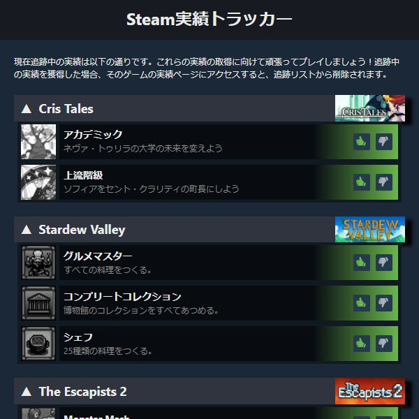
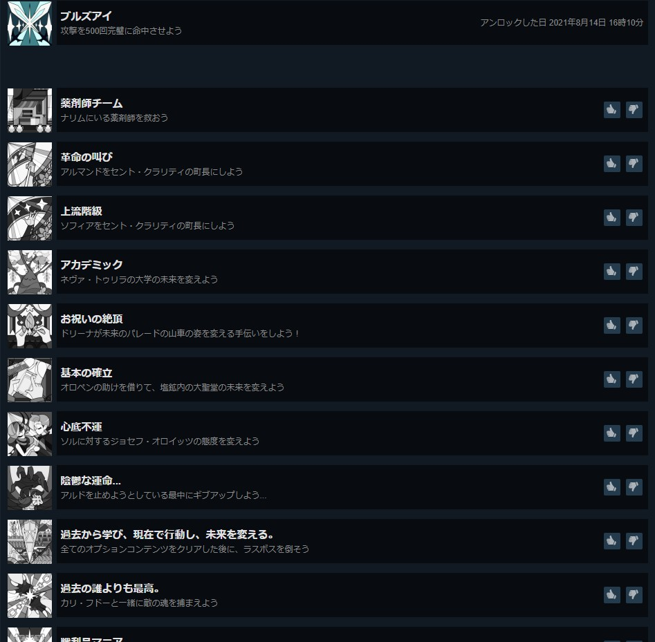
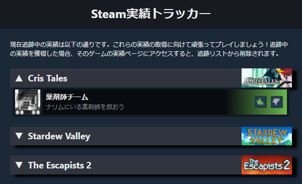
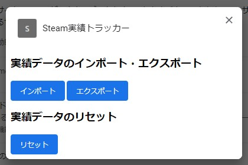

# Steam実績トラッカー
**Chrome Webストア**：準備中

Steamで獲得できそうな実績をマークし、後で確認できるようにするChrome拡張機能です。

## 使い方
Chrome Webストアより拡張機能をインストールして下さい。  
インストール後、Steamの実績ページにアクセスすると、画像のように未取得の実績に対して、Good/Badボタンが追加されています（Steamにログインしている状態で、自分の実績ページでしか表示されません）。

取得できそうだと思う実績のGoodボタンを押すと緑色でマークされます。緑色でマークされた実績は、未取得一覧の上の方に移動します。

逆に取得できなさそうな実績のBadボタンを押すと赤色でマークされます。赤色でマークされた実績は、未取得一覧の下の方に移動します。

緑色でマークした実績は、拡張機能のポップアップでいつでも確認することができます。

最初は折りたたまれている状態ですので、クリックして展開して下さい。また、各ゲームの画像をクリックすると、実績ページにジャンプできます。この画面からもマークの解除、赤色でマークができますが、リストから削除され、再びマークするには実績ページにアクセスしないといけなくなるので注意して下さい。

マークした実績を取得した場合、そのゲームの実績ページにアクセスすると自動でマーク解除されます（手動でマーク解除もできます）。

## 拡張機能の設定
「拡張機能を管理」 -> Steam実績トラッカーの「詳細」ボタン -> 「拡張機能のオプション」から設定画面にアクセスできます。

### 実績データのインポート・エクスポート
実績データの読み込みや書き込みができます。

「インポート」ボタンをおして、実績データを記録したjsonファイルを選択すると、実績データをインポートできます。既にデータが存在する場合は以下のオプションが表示されます。

**置き換え**  
既存のデータを新しいデータで置き換えます。

**追加（重複は置き換え）**  
既存のデータに新しいデータを追加します。データの重複があった場合は、新しいデータで置き換えられます。

**追加**  
既存のデータに新しいデータを追加します。データの重複があった場合は、古いデータが残されます。

### 実績データのリセット
実績データを削除します。削除すると元には戻せません。